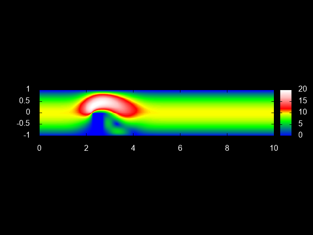

##Kompilacja i analiza wyników
<p align="justify">Do projektu dodałem makefile oraz skrypt gnuplota, które automatycznie skompilują program, uruchomią go i wygenerują wyniki.  
Należy przejść do folderu z projektem i uruchomić program `make`:</p>
```
$ make
```
Powinniśmy dostać następujący output:
```bash
g++ vi_flow.cxx -c -Wall -O2 -std=c++11 -g -lm
g++ -Wall -O2 -std=c++11 -g -lm main.cpp vi_flow.o -o main
```
Nie pozostaje już nic innego, jak program uruchomić:
```
$ make run
```
<p align="justify">Polecenie to spowoduje uruchomienie programu, a następnie gnuplota z przygotowanym wcześniej skryptem, który stowrzy trzy pliki: *velocity_abs.png*, *velocity_x.png*, oraz *velocity_y.png*. Jeżeli nie zmienialiśmy niczego w pliku main.cpp, dostaniemy również plik z wynikami numerycznymi: *ns_obstackle.dat*.  
Jeżeli chcemy wyczyścić projekt, pozbywając się wszystkich wygenerowanych do tej pory plików, mamy do tego również osobne polecenie:
```
$ make clean
```
Wyjście:
```bash
rm -f *.o *.dat *.png main
```
Jak widać, usuwa to wszystkie pliki **o**, **dat**, **png**, oraz nasz wynikowy plik wykonywalny **main**. Możemy w każdej chwili oczywiście wrócić do początku i ponownie projekt skompilować. 

Przykładowe wyniki wyglądają tak:


  
Jak widać, wyniki z gnuplota również są wymowne i czytelne.
</p> 
***