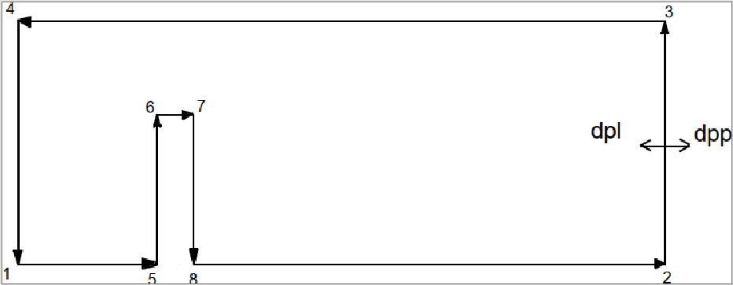

##Definiowanie geometrii
<p align="justify">Najpierw jednak należy zdefiniować geometrię. W naszym przypdaku najłatwiej będzie to zrobić tworząc plik tekstowy w fomacie **in2d**. Tworzymy więc w ulubionym edytorze dowolny plik tego typu, na przykład *example.in2d* :</p>  
```cpp
splinecurves2dv2
20

#punkty
points
1 0 -1.0
2 10.0 -1.0
3 10.0 1.0
4 0.0 1.0

5 2.3 -1.0
6 2.3 0.0
7 2.7 0.0
8 2.7 -1.0

#segmenty
segments
1 0 2 1 5 -bc=3
1 0 2 5 6 -bc=3
1 0 2 6 7 -bc=3
1 0 2 7 8 -bc=3
1 0 2 8 2 -bc=3
1 0 2 2 3 -bc=2
1 0 2 3 4 -bc=3
1 0 2 4 1 -bc=1
```
<p align="justify"> Plik **in2d** zaczynamy od słowa kluczowego `splinecurves2dv2`. Oznacza ono, że tworzymy plik 2D w geometrii splajnu.  

Następnie wpisujemy wartość parametru klasyfikującego, w naszym przypadku `20`. Określa on, jak szybko zmniejsza się rozmiar siatki. Można spokojnie zostawić taką wartość.  

Kolejnym krokiem jest wypisanie punktów. Punkty będą definiować geometrię, jednak same w sobie nic nie znaczą. Składnia punktu:  </p>
```cpp
numer wartość-OX wartosć-OY
  1        0        -1.0
```
<p align="justify">Istotne jest to, że nasza siatka znajduje się w przestrzeni kartezjańskiej, więc nie musimy zaczynać od punktu $$(0,0)$$, co ma dość istotny wpływ na obliczenia.  
Pierwsze cztery punkty definiują granice siatki. Kolejne cztery  - graniczne punkty przeszkody. Kolejność jest nieistotna, warto jendak utrzymywać tu porządek. Jak widać, nasza siatka będzie miała zakres $$x \in [0, 10]$$, $$y \in [-1, 1]$$, przeszkoda zaś $$x \in [2.3, 2.7]$$, $$y \in [-1, 0]$$.   

Następnie należy zdefiniować segmenty:  </p>
```cpp
dpl dpp linia/łuk punkt1 punt2 warunek-brzegowy
 1   0      2       1      5       -bc=3
```
<p align="justify">Pierwsze dwie kolumny to "domena po lewej" i "domena po prawej". Służą do oznaczania, gdzie wewnątrz całej przestrzeni znajduje się nasza figura.  
W kolejnej kolumnie oznaczamy, czy chcemy by nasze punkty były połączone linią prostą, czy krzywą. `2` oznacza, że linia składa się z dwóch punktów, czyli jest linią prostą. Jeżeli chcielibyśmy otrzymać krzywą, musilibyśmy wpisać `3`.  
Kolejne dwie kolumny to punkty z których będzie składać się segment. Kolejność jest bardzo istotna, co widać na obrazku poniżej.  
Na końcu nadajemy segmentowi warunek brzegowy. W tym przypadku, dla wygody oznaczyłem jako `-bc=1` lewą ściankę z której wypływa ciecz, jako `-bc=2` prawą do której ciecz wpływa, zaś `-bc=3` wszystkie ściany które będą ograniczać figurę.  
Orientacyjny rysunek pokazujący znaczenie `dpl`, `dpp`, oraz kolejności punktów:  </p>
<p align="center"> </p>
W naszym przypadku miejsca oznaczone dpl wchodzą w skład figury (wartość `1`), podczas gdy dpp nie (wartość `0`). 