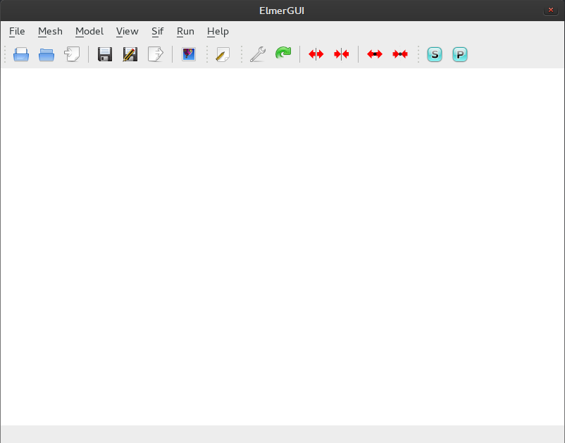
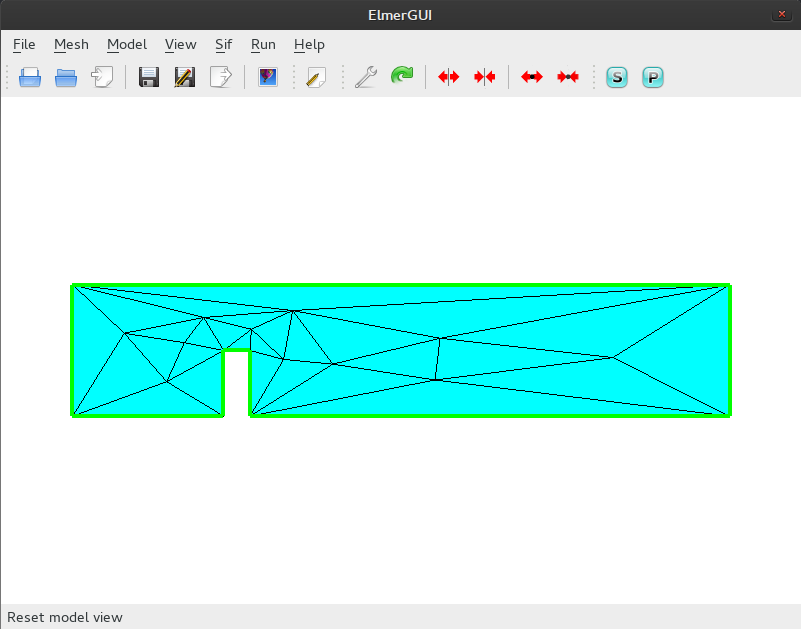
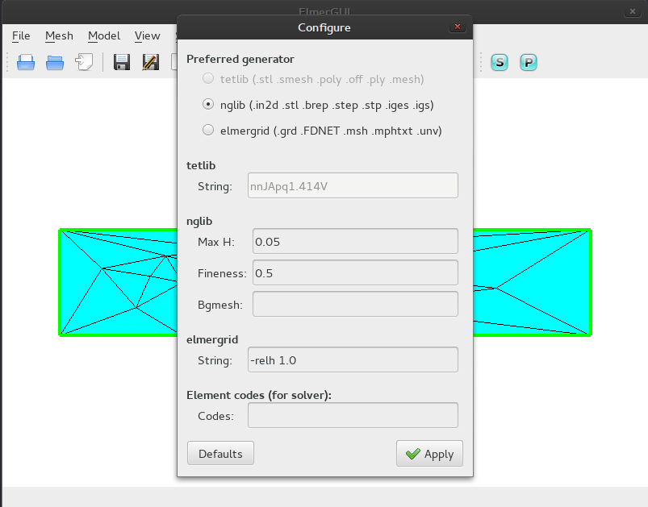
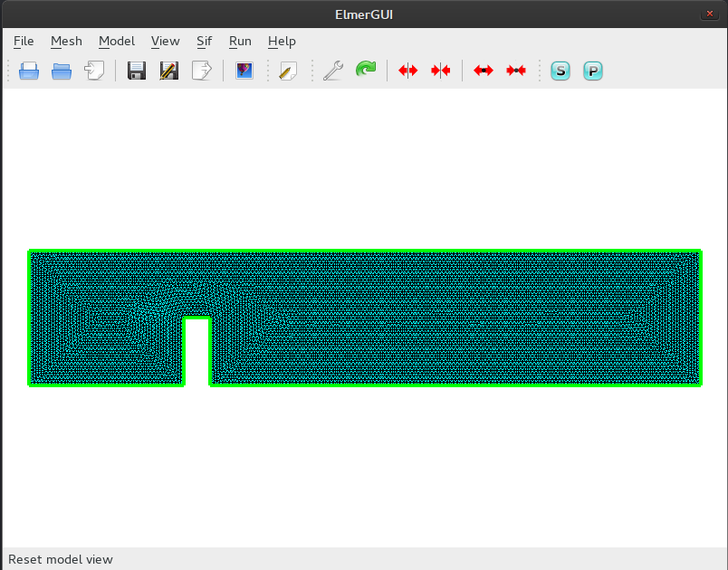

## Konfiguracja siatki
<p align="justify">  Mając zdefiniowaną figurę możemy przejść do środowiska **Elmer**. Po uruchomieniu `ElmerGUI` wita nas takie oto okno:</p>
<p align="center"> </p>
<p align="justify">Pierwsze co należy zrobić, to wybrać plik siatki:
```cpp
File
    Open
```
Po czym wybieramy nasz plik **in2d**.</p>
<p align="center"></p>
<p align="justify">Jak widać, nasza siatka niezbyt dobrze pokrywa figurę. Aby zwiększyć gęstość i tym samym dokładność obliczeń używamy menu mesh:
```cpp
Mesh
    Configure
        Max H: 0.05
        Apply
            
Mesh
    Remesh
```
Operacja i wynik:</p>
<p align="center">
  


</P>
==========================