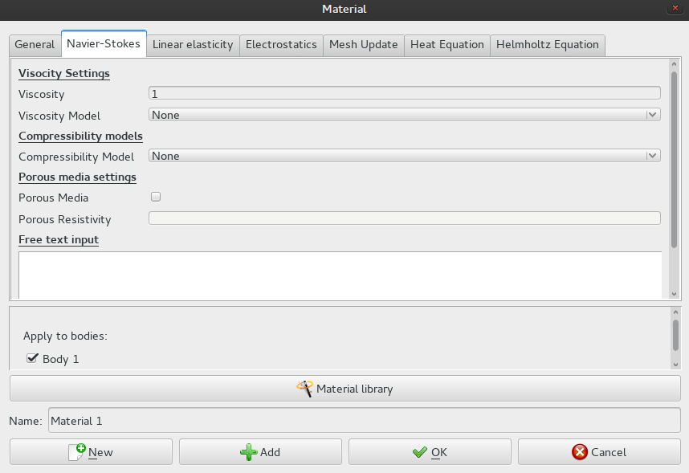

## Konfiguracja materiału
<p align="justify">Kolejny krok to ustawienie danych materiału:
```cpp
Model
    Material
        Add...
        General
            Density 1
        Navier-Stokes
            Viscosity 1
        Apply to bodies:
            [x] Body 1
        Ok
```
</p>
<p align="justify">Ustawiliśmy *gęstość*, oraz *lepkość* cieczy na 1. Takiego samego ustawienia użyjemy później w programie w **C++**.</p>
<p align="center"></p>
==========================