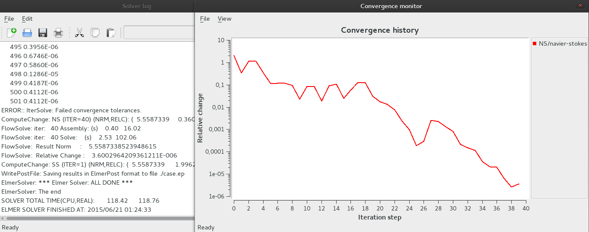
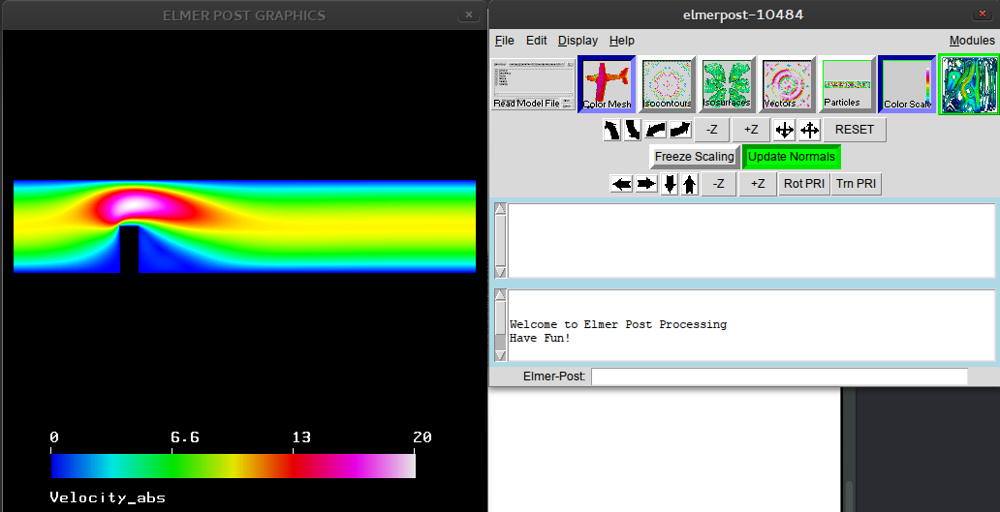
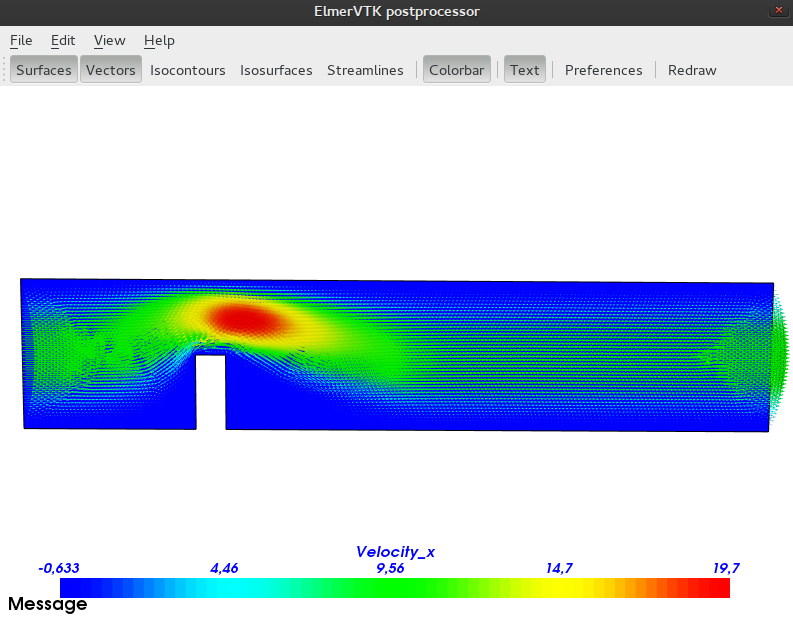

## Symulacja i analiza wyników
<p align="justify">Gdy wszystko jest ustawione, możemy rozpoczynać symulację. Wbieramy  </p>
```cpp
Run
    Start solver
```
<p align="justify">Jeżeli ustawiliśmy wszystko poprawnie, pojawią się dwa okna: **Solver log** oraz **Convergence monitor**.  
W oknie **Solver log** widzimy przebieg procesu symulacji. Nie przejmujemy się ewentualnymi błędami typu  
`Error::IterSolve: Failed convergence tolerances`.  
Oznacza to tyle, że symulatorowi w danej iteracji nie udało się uzyskać żądanej zbieżności. Po symulacji dostajemy także informacje dotyczące zużytego czasu.  
W oknie **Convergence monitor** widzimy graficzny przebieg procesu. Na osi OX mamy liczbę iteracji, na OY w skali logarymicznej zmianę wartości w ostatniej iteracji. Im bardziej wartość spada, tym szybicej uzyskujemy zbieżność. Może się zdarzyć, że podczas całego procesu nie uzyskamy zbieżności, ale wyniki wciąż będą sensowne.</p>
<p align="center"></p>
<p align="justify">Gdybyśmy chcieli koniecznie uzyskać zbieżność, konieczna byłaby zmiana dokładności, zmiana parametrów równania, lub zmiana siatki na mniej gęstą.  
  
Po zakończeniu obiczeń możemy przejść do analizy wyników. Mamy do tego celu przygotowane dwa narzędzia: **ElmerPost**, oraz **ElmerVTK**.</p>
**ElmerPost**:
<p align="center"></p>  
**ElmerVTK** z wektorami składowej poziomej prędkośći:
<p align="center"></p>  
<p align="justify">Obydwie aplikacje dają nam całą gamę dostępnych opcji, których wykorzystanie zależy głównie od typu symulacji , oraz naszych indywidualnych potrzeb. Przy porównywaniu wyników będziemy wykorzystywać jedynie opcje dotyczące prędkości ogólnej, oraz składowej poziomej i pionowej.
</p>
.