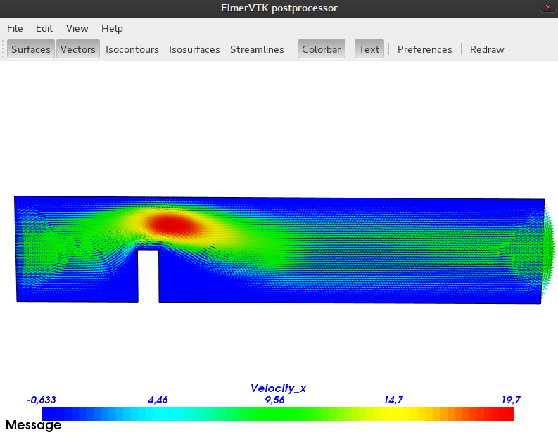

## Składowa pozioma
Przyjrzyjmy się najpierw wynikom z **Elmera**:

  

Widzimy, że wektor prędkości strumienia uzyskuje największe skupienie zaraz za przewężeniem, uzyskując prędkość około 20 jednostek. Prędkość stopniowo rozkłada się w sposób eliptyczny wokół ogniska, uzyskując coraz mniejsze wartości. Wyniki najniższe możemy obserwować na brzegach, oraz w dolnych partiach przeszkody, co raczej nie jest w tym przypadku zaskoczeniem. Warto zauważyć, że na prawo od przeszkody, niemal bezpośrednio pod ogniskiem, obszar o bardzo niskiej prędkość jest dużo dłuższy niż po lewej.

***
Wyniki z **C++**:

Jak widać powyżej, wyniki są dość podobne, jednak różnice są widoczne gołym okiem. Ognisko jest przesunięte nieco bardziej w lewo, bezpośrednio nad przeszkodę. Rozkład prędkości z eliptycznego przyjął kształt ziarna fasoli, poza tym strefa o największej prędkości wydaje się być nieco szersza. Cały kształt jakby mniej rozszerza się w prawym kierunku. O ile wartości bliskie 0 wydają się być zachowane na brzegach i na lewo od przeszkody, o tyle na prawo postaje pole o bardzo niskiej prędkości ujemnej, mogące stanowić przyczynę powstania wiru w tym miejscu. Jest to chyba najistotniejsza zmiana względem wyniku **Elmera**.

***